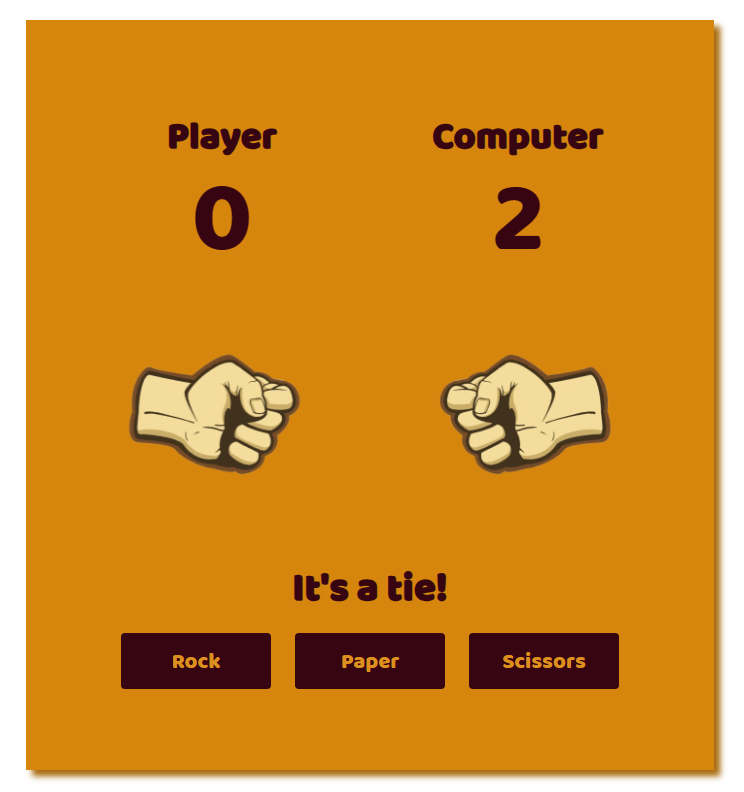
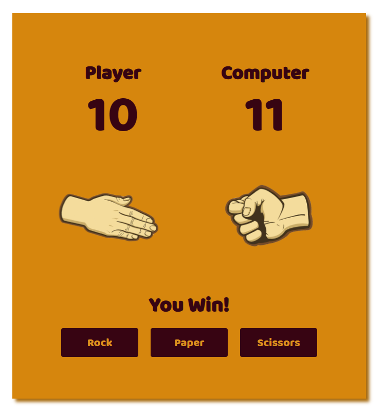

# Rock Paper Scissors Game

## Description
This is a simple Rock Paper Scissors game created by Kavan Bhavsar. It's a fun and interactive game that you can play against the computer.

## Features
- Choose between Rock, Paper, and Scissors.
- Play against the computer.
- Keep track of your score against the computer.

## Usage
1. Visit <a href="https://kavanbhavsar35.gtihub.io/Rock-Paper-Scissor" >here</a> or clone the repository to your local machine and open `index.html` in your desired browser.
2. Click the "Start Playing" button to begin the game.
3. Choose your move by clicking the "Rock," "Paper," or "Scissors" buttons.
4. The computer will make its move.
5. The game will announce the winner, and your score will be updated accordingly.
6. Continue playing and try to beat the computer.

## Author
- **Kavan Bhavsar**
  - GitHub: [Kavan Bhavsar](https://github.com/kavanbhavsar35)

## Technologies Used
- HTML
- CSS
- JavaScript

## Screenshots

## License
This project is open source and available under the [MIT License](LICENSE.txt).

Feel free to contribute or use this project as a learning resource for web development.